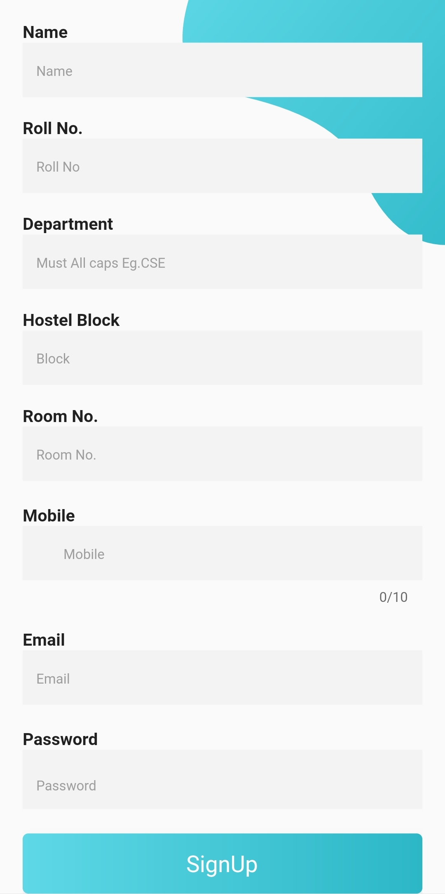
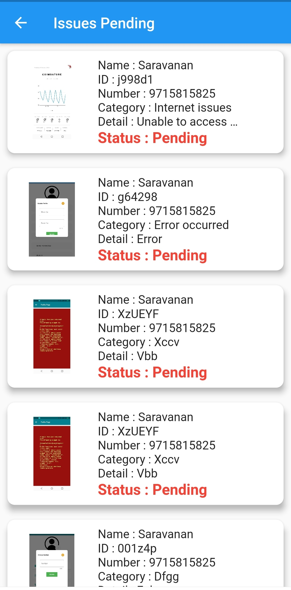
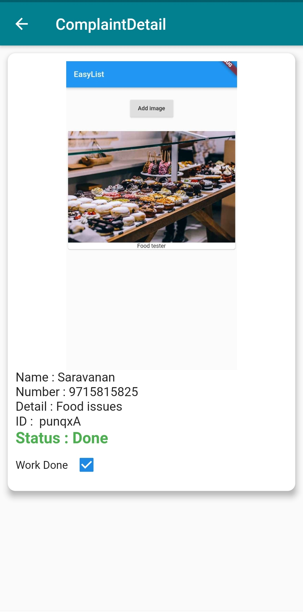
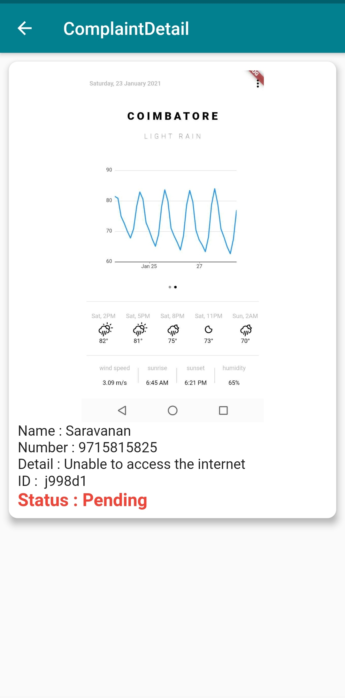
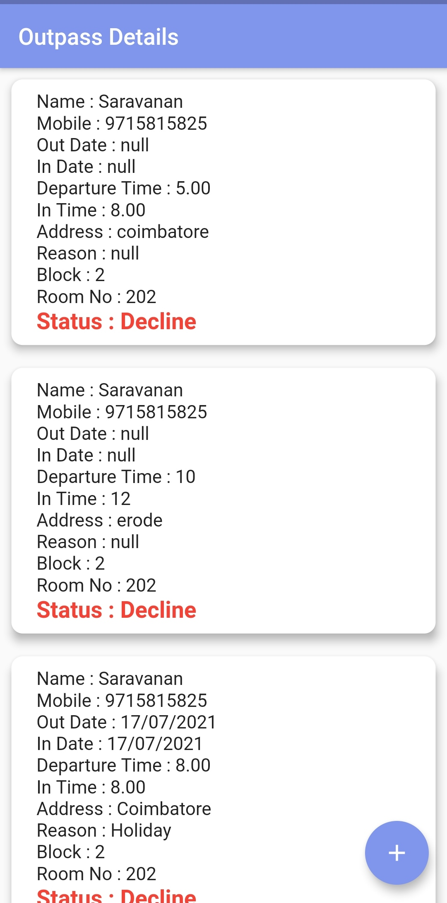

# Hostel-App

<table>
<thead>
<tr>
<th style="text-align:center"><code>Login </code></th>
<th style="text-align:center"><code>Sign Up 1</code></th>
<th style="text-align:center"><code>Sign Up 2</code></th>
</tr>
</thead>
<tbody>
<tr>
<td style="text-align:center"></td>
<td style="text-align:center"></td>
 <td style="text-align:center"></td>  
</tr>
</tbody>
</table>

<h2 align="center">ADMIN PAGES</h2>
<table>
<thead>
<tr>
<th style="text-align:center"><code>Admin Dashboard 1 </code></th>  
<th style="text-align:center"><code>Admin Dashboard 2 </code></th>
<th style="text-align:center"><code>Issues Page</code></th>
</tr>
</thead>
<tbody>
<tr>
  <td style="text-align:center"></td>
  <td style="text-align:center">
  <td style="text-align:center"></td>  
</tr>
</tbody>
</table>
   
  <table>
<thead>
<tr>
<th style="text-align:center"><code>Issue Detail Page</code></th>  
<th style="text-align:center"><code>Issue Detail Page</code></th>
<th style="text-align:center"><code>Outpass Page</code></th>
</tr>
</thead>
<tbody>
<tr>
  <td style="text-align:center"></td>
  <td style="text-align:center">
  <td style="text-align:center"></td>  
</tr>
</tbody>
</table>
   
<table>
<thead>
<tr>
<th style="text-align:center"><code>Outpass Approved Page</code></th>  
<th style="text-align:center"><code>Outpass Decline Page</code></th>
<th style="text-align:center"><code>Outpass Detail Page</code></th>
</tr>
</thead>
<tbody>
<tr>
  <td style="text-align:center"></td>
  <td style="text-align:center">
  <td style="text-align:center"></td>  
</tr>
</tbody>
</table>
   
  <table>
<thead>
<tr>
<th style="text-align:center"><code>Food Page</code></th>  
<th style="text-align:center"><code>Add Food</code></th>
<th style="text-align:center"><code>Edit Food</code></th>
</tr>
</thead>
<tbody>
<tr>
  <td style="text-align:center"></td>
  <td style="text-align:center">
  <td style="text-align:center"></td>  
</tr>
</tbody>
</table>
   
  <table>
<thead>
<tr>
<th style="text-align:center"><code>Students Page</code></th>  
<th style="text-align:center"><code>Student Detail Page</code></th>
<th style="text-align:center"><code>Edit Student Profile</code></th>
</tr>
</thead>
<tbody>
<tr>
  <td style="text-align:center"></td>
  <td style="text-align:center">
  <td style="text-align:center"></td>  
</tr>
</tbody>
</table>

<h2 align="center">STUDENT PAGES</h2>
<table>
<thead>
<tr>
<th style="text-align:center"><code>Student Dashboard</code></th>  
<th style="text-align:center"><code>Student Profile </code></th>
<th style="text-align:center"><code>Student Profile Update</code></th>
</tr>
</thead>
<tbody>
<tr>
  <td style="text-align:center"></td>
  <td style="text-align:center">
  <td style="text-align:center"></td>  
</tr>
</tbody>
</table>
   
 <table>
<thead>
<tr>
<th style="text-align:center"><code>Student Issues Page</code></th>  
<th style="text-align:center"><code>Issues Detail Page</code></th>
<th style="text-align:center"><code>Issues Create Page</code></th>
</tr>
</thead>
<tbody>
<tr>
  <td style="text-align:center"></td>
  <td style="text-align:center">
  <td style="text-align:center"></td>  
</tr>
</tbody>
</table>
   
<table>
<thead>
<tr>
<th style="text-align:center"><code>Food Detail Page</code></th>  
<th style="text-align:center"><code>Outpass Page</code></th>
<th style="text-align:center"><code>Outpass Decline</code></th>
</tr>
</thead>
<tbody>
<tr>
  <td style="text-align:center"></td>
  <td style="text-align:center">
  <td style="text-align:center"></td>  
</tr>
</tbody>
</table>
   
  <table>
<thead>
<tr>
<th style="text-align:center"><code>Outpass Apply</code></th>  
<th style="text-align:center"><code>Outpass Apply</code></th>
<th style="text-align:center"><code>Outpass Apply</code></th>
</tr>
</thead>
<tbody>
<tr>
  <td style="text-align:center"></td>
  <td style="text-align:center">
  <td style="text-align:center"></td>  
</tr>
</tbody>
</table>
   
  

